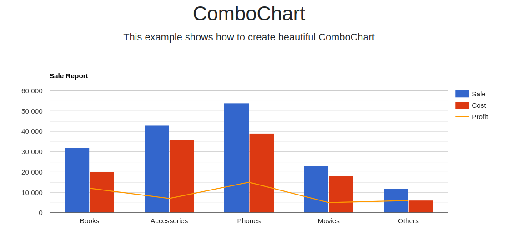

# KoolReport in Laravel 11?

Laravel is a web application framework with expressive, elegant syntax. We believe development must be an enjoyable and creative experience to be truly fulfilling.

KoolReport is reporting framework and can be integrated into Laravel or any other MVC framework. KoolReport help you to create data report faster and easier.

In this repository, we would like to demonstrate how KoolReport can be used in Laravel.

# Installation

Run `composer` command in your Laravel directory to install `koolreport/core` and `koolreport/laravel`

```
composer require koolreport/core
composer require koolreport/laravel
```
or install `koolreport/pro` if you have a license for it

```
composer require koolreport/pro
```

# Create reports using friendship trait for setting up assets and datasources

1. Inside `app` directory, create `reports` subdirectory to hold your reports.
2. Create `MyReport.php` and `MyReport.view.php` inside `reports` directory. Assign `App\reports` namespace for the report if you want it can be autoloaded. Otherwise, you could load the report directly in your controller when using it. Please see the contents of two files in our repository.
3. Add \koolreport\laravel\Friendship trait to your report like following:

```
class MyReport extends \koolreport\KoolReport
{
    use \koolreport\laravel\Friendship;
    ...
```
This trait would help the report to publish js, css assets to Laravel's `public` directory in a subdirectory called `asset/koolreport_assets` as well as allow using Laravel's database settings in the report.

## Create route and action

In `routes/web.php`, create a route to your report and its action with a controller:

```
Route::get('/customReport', 'App\Http\Controllers\Home@customReport');
```

In the `Home` controller (`app/Http/Controllers/Home.php`), create the action method:

```
public function customReport()
{
    $report = new \App\reports\MyReport();
    $report_content = $report->run()->render(true);
    return view("customReport", ["report_content" => $report_content]);
}
```
Create the report view `resources/views/customReport.php` and put your report content anywhere you like:

```
<html>
...
<?php echo $report_content; ?>
</html>
```

All done!

## View result

First start the PHP built-in server in your Laravel directory:


```
php artisan serve
```
Then you can access after running

```
http://locahost:8000/customReport
```




## CSRF field/token in form submissions and xhr requests

In reports with form submission or xhr request users need to add csrf field/token to the form and request for server response to work.

For example, adding csrf field to form:

```
    <form method="post">
        <?php echo csrf_field(); ?>
```
or add csrf token to request:

```
    <script>
        subReport.update("SaleByCountriesReport", {
            _token:'<?php echo csrf_token(); ?>'
        });
```

# Summary

KoolReport is a great php reporting framework. You can use KoolReport alone with pure php or inside any modern MVC frameworks like Laravel, CakePHP, CodeIgniter, Yii2. If you have any questions regarding KoolReport, free free to contact us at [our forum](https://www.koolreport.com/forum/topics) or email to [support@koolreport.com](mailto:support@koolreport.com).

__Happy Reporting!__